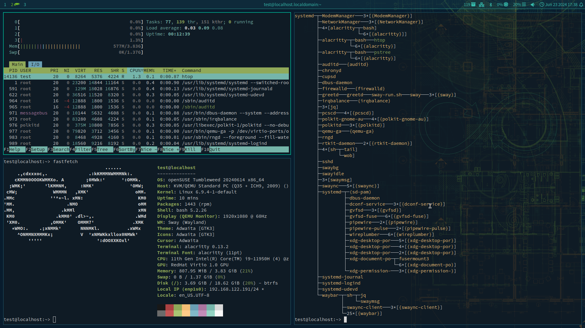

# openSUSEway
dotfiles for Sway on openSUSE

## Screenshots

## Installation instructions

To install openSUSEway, please follow the instructions in the Install section of
the [openSUSEway Portal](https://en.opensuse.org/Portal:OpenSUSEway).

## More resources
Social channels for support and project discussion (bridged together):

- [openSUSEway Telegram channel](https://t.me/openSUSEway)

- [#opensuseway:opensuse.org Matrix channel](https://matrix.to/#/#opensuseway:opensuse.org)

[openSUSEway Portal](https://en.opensuse.org/Portal:OpenSUSEway) for more details on the openSUSEway desktop environment for openSUSE.

[Sway openSUSE wiki page](https://en.opensuse.org/Sway) for more details about Sway on openSUSE.

Please check [Manage-dotfiles-with-Git](https://news.opensuse.org/2020/03/27/Manage-dotfiles-with-Git/) on how to use dotfiles.

## Other dotfiles examples:
* https://github.com/jjquin/swayarch
* https://github.com/jjquin/dotfiles

## Other openSUSE sway derivatives

  - https://sr.ht/~mcepl/moldavite/
  - https://github.com/ProjectGreybeard/Info
